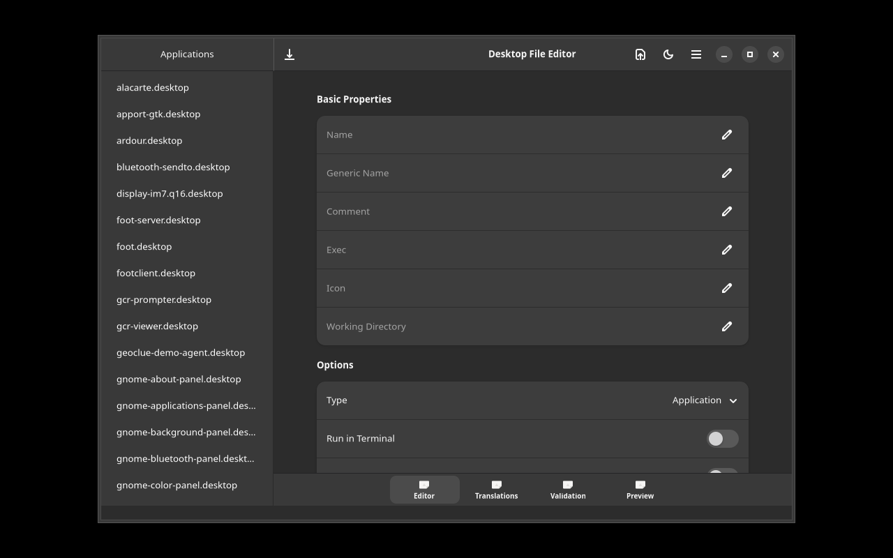

# Desktop File Editor

A GTK4/Adwaita application for visually editing `.desktop` files with preview, validation, and translation management.



## Features

- Open/create `.desktop` files
- Visual editor for Name, Comment, Exec, Icon, Categories, etc.
- Preview: how the app looks in the app launcher
- View all translations (Name[sv], Comment[de], etc.)
- Add/remove translations per language
- Validation against freedesktop.org spec
- Warnings for missing icons, invalid Exec, etc.
- Browse /usr/share/applications/ and ~/.local/share/applications/

## Installation

### Debian/Ubuntu

```bash
# Add repository
curl -fsSL https://yeager.github.io/debian-repo/KEY.gpg | sudo gpg --dearmor -o /usr/share/keyrings/yeager-archive-keyring.gpg
echo "deb [signed-by=/usr/share/keyrings/yeager-archive-keyring.gpg] https://yeager.github.io/debian-repo stable main" | sudo tee /etc/apt/sources.list.d/yeager.list
sudo apt update
sudo apt install desktop-editor
```

### Fedora/RHEL

```bash
sudo dnf config-manager --add-repo https://yeager.github.io/rpm-repo/yeager.repo
sudo dnf install desktop-editor
```

### From source

```bash
pip install .
desktop-editor
```

## 🌍 Contributing Translations

Help translate this app into your language! All translations are managed via Transifex.

**→ [Translate on Transifex](https://app.transifex.com/danielnylander/desktop-editor/)**

### How to contribute:
1. Visit the [Transifex project page](https://app.transifex.com/danielnylander/desktop-editor/)
2. Create a free account (or log in)
3. Select your language and start translating

### Currently supported languages:
Arabic, Czech, Danish, German, Spanish, Finnish, French, Italian, Japanese, Korean, Norwegian Bokmål, Dutch, Polish, Brazilian Portuguese, Russian, Swedish, Ukrainian, Chinese (Simplified)

### Notes:
- Please do **not** submit pull requests with .po file changes — they are synced automatically from Transifex
- Source strings are pushed to Transifex daily via GitHub Actions
- Translations are pulled back and included in releases

New language? Open an [issue](https://github.com/yeager/desktop-editor/issues) and we'll add it!

## License

GPL-3.0-or-later — Daniel Nylander <daniel@danielnylander.se>
