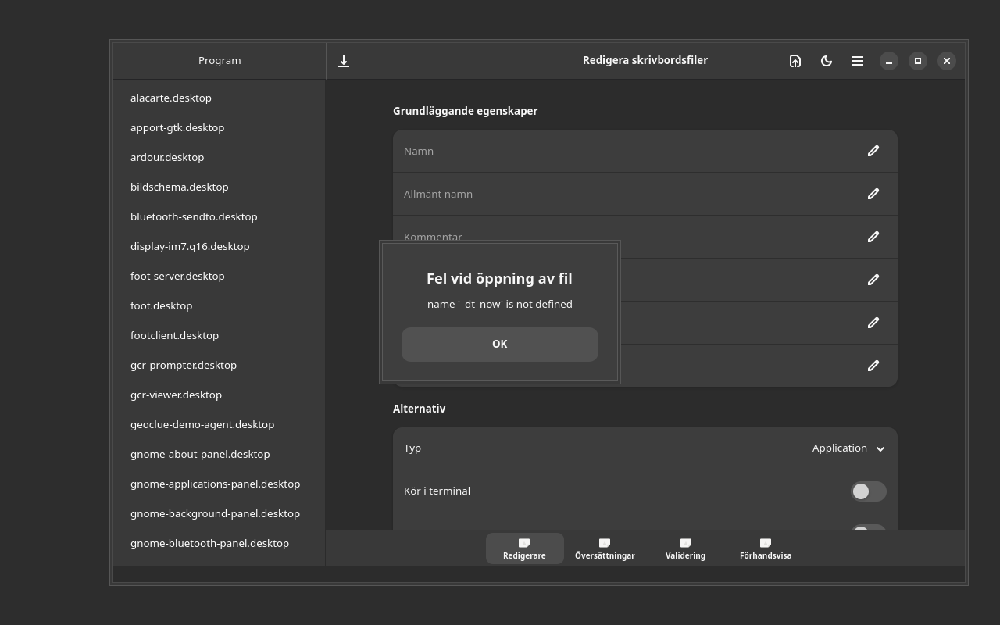

# Desktop File Editor

## Screenshot



A GTK4/Adwaita application for visually editing `.desktop` files with preview, validation, and translation management.


## Features

- Open/create `.desktop` files
- Visual editor for Name, Comment, Exec, Icon, Categories, etc.
- Preview: how the app looks in the app launcher
- View all translations (Name[sv], Comment[de], etc.)
- Add/remove translations per language
- Validation against freedesktop.org spec
- Warnings for missing icons, invalid Exec, etc.
- Browse /usr/share/applications/ and ~/.local/share/applications/

## Installation

### Debian/Ubuntu

```bash
# Add repository
curl -fsSL https://yeager.github.io/debian-repo/KEY.gpg | sudo gpg --dearmor -o /usr/share/keyrings/yeager-archive-keyring.gpg
echo "deb [signed-by=/usr/share/keyrings/yeager-archive-keyring.gpg] https://yeager.github.io/debian-repo stable main" | sudo tee /etc/apt/sources.list.d/yeager.list
sudo apt update
sudo apt install desktop-editor
```

### Fedora/RHEL

```bash
sudo dnf config-manager --add-repo https://yeager.github.io/rpm-repo/yeager.repo
sudo dnf install desktop-editor
```

### From source

```bash
pip install .
desktop-editor
```

## 🌍 Contributing Translations

This app is translated via Transifex. Help translate it into your language!

**[→ Translate on Transifex](https://app.transifex.com/danielnylander/desktop-editor/)**

Currently supported: Swedish (sv). More languages welcome!

### For Translators
1. Create a free account at [Transifex](https://www.transifex.com)
2. Join the [danielnylander](https://app.transifex.com/danielnylander/) organization
3. Start translating!

Translations are automatically synced via GitHub Actions.

## License

GPL-3.0-or-later — Daniel Nylander <daniel@danielnylander.se>
